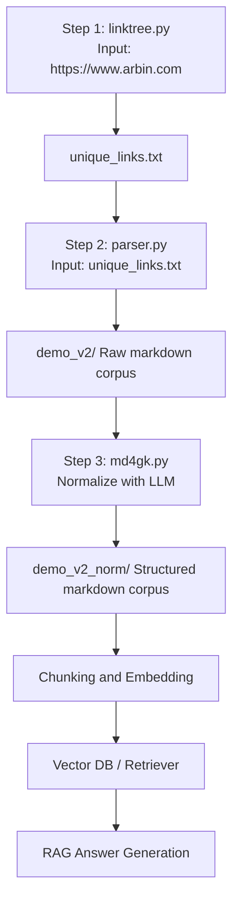

# Arbin Crawler Workflow

This repository provides a 3-step pipeline for crawling and normalizing website content.

## Documentation

- [LINKTREE.md](LINKTREE.md): Link discovery and category export
- [PARSER.md](PARSER.md): Crawl URLs to markdown exports
- [MD4GK.md](MD4GK.md): Normalize markdown with LLM for KG-ready structure
- [HIRAG.md](HIRAG.md): Build/query HiRAG index from normalized markdown corpus

## End-to-end example (arbin.com)

```bash
py linktree.py --url https://www.arbin.com --max-depth 1 --output-unique-links unique_links.txt
py parser.py --input unique_links.txt --output demo_v2 --footer-markers sample.footer-markers.txt --slug-stop sample.slug-stop.txt
py md4gk.py --config-file sample.md4gk.config.txt --api-key YOUR_OPENAI_API_KEY
py hirag_runner.py --config-file sample.hirag.config.txt --query "What are Arbin's key battery testing capabilities?" --mode hi
```

Outputs:

- `unique_links.txt`
- `demo_v2/`
- `demo_v2_norm/`
- `hirag_workdir/`

See [PARSER.md](PARSER.md) and [MD4GK.md](MD4GK.md) for alternative flag combinations.

## Pipeline (Summary)



RAG purpose by step:

1. `linktree.py` -> discover/canonicalize URLs (`unique_links.txt`) for indexing coverage.
2. `parser.py` -> extract readable page content to corpus (`demo_v2/`).
3. `md4gk.py` -> normalize structure for better chunking/retrieval (`demo_v2_norm/`).
4. `hirag_runner.py` -> chunk + embed + graph index into HiRAG working directory.
5. `hirag_runner.py --query ...` -> retrieve + generate grounded answers from indexed Arbin content.

## Sample config files used

- `sample.footer-markers.txt` for parser flag `--footer-markers`
- `sample.slug-stop.txt` for parser flag `--slug-stop`
- `sample.config.parser.txt` combined parser reference template
- `sample.md4gk.config.txt` for md4gk flag `--config-file`
- `sample.md4gk.instruction.txt` for md4gk flag `--instruction-file`
- `sample.hirag.config.txt` for HiRAG runner flag `--config-file`

## Output mapping summary

- Linktree result: `unique_links.txt`
- Parser result: `demo_v2/`
- md4gk result: `demo_v2_norm/`
- HiRAG result: `hirag_workdir/`
